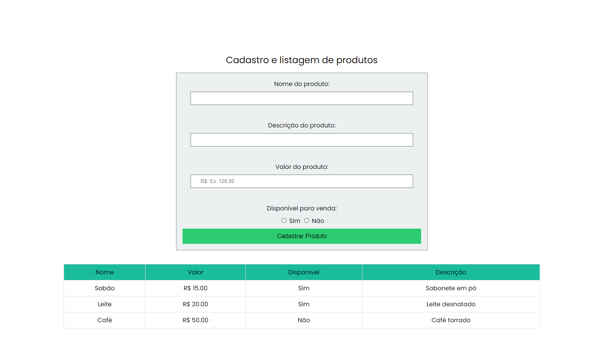

# Cadastro e Listagem de Produtos

Este projeto é um sistema simples para cadastro e listagem de produtos, desenvolvido com **HTML, CSS e JavaScript**. Ele permite adicionar produtos a uma tabela e exibir os dados de forma organizada.

## 📌 Funcionalidades

- **Cadastro de produtos** com nome, descrição, valor e disponibilidade.
- **Prevenção de atualização da página** ao adicionar um novo produto.
- **Listagem dinâmica** de produtos em uma tabela.
- **Ordenação automática** da tabela pelo valor do produto (do menor para o maior).

## 🛠️ Tecnologias Utilizadas

- HTML5
- CSS3
- JavaScript (DOM Manipulation)

